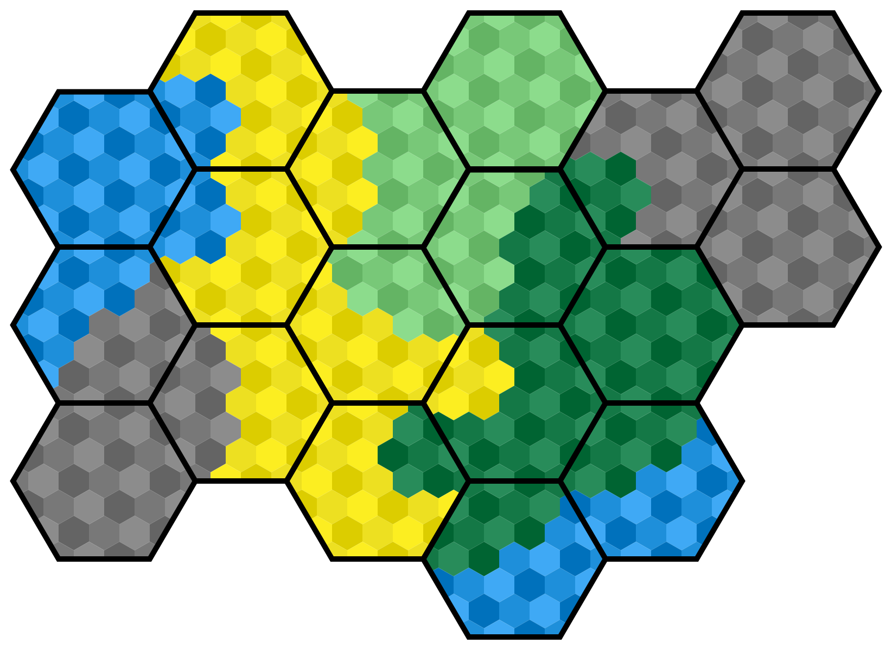
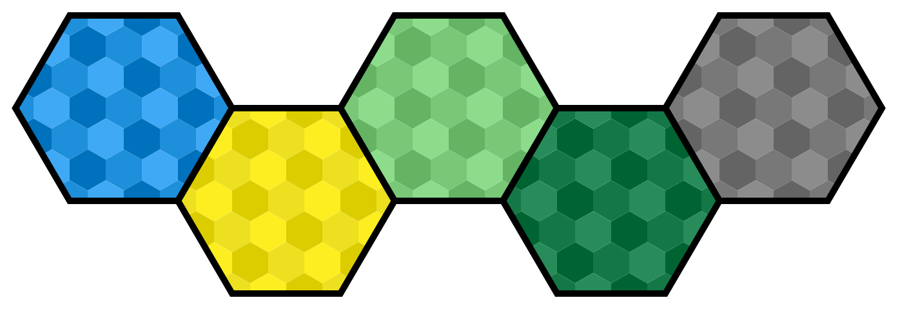

### 
- Fait par Alexis Hadjem-Brancher, Thomas Renault, Louis Tanchou

## ATENTION ! Ceci est un deuxieme répos suite a un probleme technique, les premiers commit sont sur notre ancien repos : [Premier Repo Bugger](https://grond.iut-fbleau.fr/hadjem-b/SAE31_2024)
## Projet de groupe SAE 3.1 
Le project est fait en [Java](https://www.java.com/fr/) ([JDK-18](https://www.oracle.com/fr/java/technologies/downloads/#jdk21) **Minimum**) a l'aide de [swing](https://download.java.net/java/early_access/loom/docs/api/java.desktop/javax/swing/package-summary.html).
l'archive JAR est éxécutable et ne require rien d'autre que [JDK-18](https://www.oracle.com/fr/java/technologies/downloads/#jdk21-windows)

### Information sur la Base de données : [bdd](InfoBDD/BDD.md)

## Notre version
### Notre version se divise en plusieurs parties :
- ### Le menu du jeux : 
  - Choisir sont username
  - Choisir la suite de tuile avec laquel ont va jouer
  - Boutton pour aller voir la liste des parties jouer (a revoir)
  - Bouton pour lancer le jeux

- ### La liste des parties jouer
  - a détailler

- ### Le Jeux en lui même : 
  - Méthode de placement des tuiles : 
    - Bouton pour placer une tuiles adjacentes a une autres
    - placement uniquemment adjacent a une tuile deja présente
  

  - Methode de déplacement de la caméra : 
    - Déplacement "drag" on reste appuyer sur clique gauche et on déplace

### [Sujet](https://iut-fbleau.fr/sitebp/sae3/31_2024/M67XNS5HAF8M5DAN.php) :
### Paysages
Dans ce jeu inspiré librement de Dorfromantik, le joueur doit assembler des tuiles hexagonales pour former un paysage harmonieux.

### Tuiles
Les tuiles servent à délimiter cinq terrains différents : mer, champ, pré, forêt et montagne.

### Parties
Une partie se déroule de la façon suivante. La première tuile est posée automatiquement. À chaque tour, une tuile est révélée au joueur, et celui-ci choisit la position et l'orientation dans laquelle poser cette tuile. La seule contrainte est que la nouvelle tuile doit être adjacente à une tuile déjà posée.

La partie se termine lorsque 50 tuiles ont été posées. On calcule alors le score du joueur en additionnant les points obtenus pour chaque poche de terrain. Si deux tuiles sont connectées par des côtés qui montrent le même terrain, ces tuiles appartiennent à la même poche. Le nombre de tuiles dans une poche, élévé au carré, donne le nombre de points accordés.

2²+2²+2²+2²+1² = 17 points

Notez qu'un paysage peut contenir plusieurs poches isolées du même terrain. Une tuile qui contient deux terrains compte obligatoirement pour deux poches différentes.

### Serveur
Un serveur de base de données sert à retenir les parties disponibles et les scores des joueurs (de façon anonyme).

Pour que deux scores puissent être comparés, il faut qu'ils correspondent à des parties qui ont utilisé la même série de tuiles.

Le serveur se souvient donc d'un certain nombre de séries sur lesquelles les joueurs peuvent baser leur partie. Il n'est pas demandé de coder la possibilité d'ajouter une série, mais pour pouvoir tester le programme, plusieurs séries devront être déjà présentes sur le serveur.

Lorsqu'un joueur débute une partie, il doit choisir parmi les séries disponibles (sans voir leur contenu). À la fin de la partie, le programme utilise les scores connus du serveur pour cette série afin de montrer au joueur la qualité de son score.